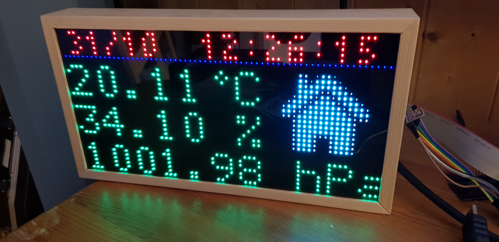
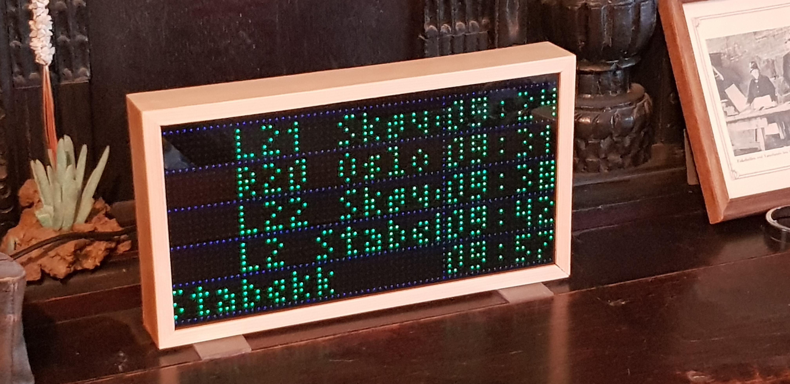

# hub75-weather
Using a raspberry pi to display weather data and norwegian train departures on a hub75 display

Installation on raspbian lite:

sudo apt-get install python3-pip
sudo pip3 install RPi.bme280
sudo pip3 install aiohttp
sudo pip3 install enturclient
sudo pip3 install apds9960
sudo pip3 install apscheduler
sudo pip3 install python-twitter
sudo pip3 install feedparser

sudo apt-get update
sudo apt-get install python3.7-dev python3-pil

Clone https://github.com/hzeller/rpi-rgb-led-matrix

robin@raspberrypi:~/entur/rpi-rgb-led-matrix $ make build-python
sudo make install-python

make build-python PYTHON=$(which python3)
sudo make install-python PYTHON=$(which python3)

Switch off on-board sound (`dtparam=audio=off` in `/boot/config.txt`).

